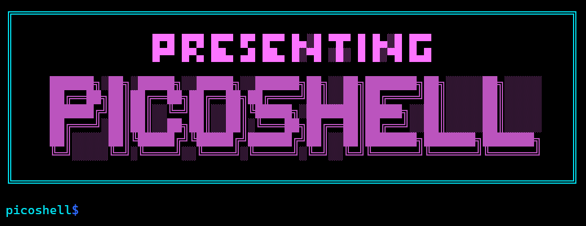

# PicoShell 🐚



[](https://github.com/HemanthBangera/PicoShell)
[](https://github.com/HemanthBangera/PicoShell)
[](LICENSE)
[](https://github.com/HemanthBangera/PicoShell)
[](https://github.com/HemanthBangera/PicoShell/pulls)

A lightweight shell implementation written in C that recreates core functionality of a Unix shell. PicoShell is an educational project designed to demonstrate systems programming concepts while providing a functional shell environment with lexing, parsing, command execution, pipelines, redirections, environment expansion, builtins, and heredocs.

## ✨ Features

- **Complete Shell Pipeline**: Lexer → Parser → AST → Executor
- **Advanced I/O**: Input/Output redirection and pipelines
- **Environment Management**: Variable expansion and manipulation
- **Built-in Commands**: Essential shell builtins implementation
- **Heredoc Support**: Multi-line input processing
- **Error Handling**: Comprehensive error reporting
- **Memory Safe**: Proper memory management and cleanup

## 🚀 Quick Start

### Prerequisites

- GCC compiler (C99 or later)
- Make
- Unix-like operating system (Linux, macOS)

### Installation

```bash
# Clone the repository
git clone https://github.com/HemanthBangera/PicoShell.git

# Navigate to project directory
cd PicoShell

# Build the project
make

# Run the shell
./picoshell
